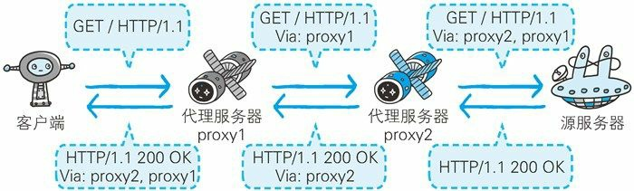

# 图解HTTP 笔记
## 网络基础
TCP/IP 协议(protocol)
TCP/IP 协议族按层次分别分为以下 4 层:应用层、传输层、网络层和数据链路层。
应用层决定了向用户提供应用服务时通信的活动。FTP / DNS / HTTP等
传输层： 提供处于网络连接中的两台计算机之间的数据传输。TCP(Transmission ControlProtocol,传输控制协议)和 UDP(User Data Protocol,用户数据报协议)。
网络层用来处理在网络上流动的数据包。
链路层(又名数据链路层,网络接口层) 包括控制操作系统、硬件的设备驱动、NIC(Network Interface Card,网络适配器,即网卡),及光纤等物理可见部分(还包括连接器等一切传输媒介)。硬件上的范畴均在链路层的作用范围之内。

与 HTTP 关系密切的协议 : IP(负责传输)、TCP（确保可靠性，提供可靠的字节流服务，采用三次握手策略） 和DNS
握手过程中使用了 TCP 的标志(flag) —— SYN(synchronize) 和
ACK(acknowledgement)。
发送端首先发送一个带 SYN(synchronize）标志的数据包给对方。接收端收到后,
回传一个带有 SYN/ACK 标志的数据包以示传达确认信息。最后,发
送端再回传一个带 ACK 标志的数据包,代表“握手”结束。

Http协议的职责：  生成针对目标web服务器的Http请求报文
TCP协议的职责： 为了方便通信，把Http请求报文分割成多个报文段，把每个报文安全可靠的传送到目的地
IP 协议的职责： 搜索对方的地址，一边传送一边中转
TCP协议的职责： 收到报文，重组报文段
Http协议的职责：对请求进行处理

URI(统一资源标识符)  URL (统一资源定位符)。URL 正是使用 Web 浏览器等访问 Web 页面时需要输入的网页地址。
URI 用字符串标识某一互联网资源,而 URL 表示资源的地点(互联网上所处的位置)  url是uri的子集
绝对 URI 的格式： 协议：//<用户名>:<密码>@<主机>:<端口>/<url路径>

## Http协议
主要使用HTTP/1.1版本
### 客户端请求报文： 
请求报文是由请求方法、请求 URI、协议版本、可选的请求首部字段和内容实体构成的。
- 请求头： 第一行分别是请求方法 字符串 /index.htm 指明了请求访问的资源对象，也叫做请求 URI(request-URI) HTTP/1.1（协议版本）
```
GET /index.htm HTTP/1.1
Host: hackr.jp
Connection: keep-alive
Accept-Language: zh-CN,zh;q=0.9
Cache-Control: max-age=0
...
```
- 请求体 就是查询参数等

### 服务器响应报文：  
响应报文基本上由协议版本、状态码(表示请求成功或失败的数字代
码)、用以解释状态码的原因短语、可选的响应首部字段以及实体主体构成。
- 响应头：
```
HTTP/1.1 200 OK
Bdpagetype: 3
Cache-Control: private
Ckpacknum: 2
Ckrndstr: 800061f0a
Connection: keep-alive
Content-Encoding: gzip
Content-Type: text/html;charset=utf-8
Date: Mon, 22 Feb 2021 12:23:35 GMT
Server: BWS/1.1
Set-Cookie: delPer=0; path=/; domain=.baidu.com
Set-Cookie: BD_CK_SAM=1;path=/
Set-Cookie: PSINO=3; domain=.baidu.com; path=/
Set-Cookie: BDSVRTM=24; path=/
Set-Cookie: H_PS_PSSID=33425_33517_33273_31254_33570_33584_26350; path=/; domain=.baidu.com
Strict-Transport-Security: max-age=172800
Traceid: 1613996615055173479416428008804916272906
Vary: Accept-Encoding
X-Ua-Compatible: IE=Edge,chrome=1
Transfer-Encoding: chunked
```
- 响应体
```
<!DOCTYPE html>
<!--STATUS OK-->
<html>
。。。。
</html>
```

### 无状态
http是无状态协议，TTP 协议自身不对请求和响应之间的通信状态进行保存。不知道给客户端之前响应过什么内容，HTTP 协议自身不具备保存之前发送过的请求或响应的功能，
可是,随着 Web 的不断发展,因无状态而导致业务处理变得棘手的情况增多了。典型的页面调转重复登陆问题，
HTTP/1.1 虽然是无状态协议,但为了实现期望的保持状态功能,于是引入了 Cookie 技术。有了 Cookie 再用 HTTP 协议通信,就可以管理状态了。

### 告知服务器意图的 HTTP 方法
GET :获取资源
POST:传输实体主体（把信息告诉服务器）
PUT:传输文件   鉴于 HTTP/1.1 的 PUT 方法自身不带验证机制,任何人都可以上传文件 , 存在安全性问题,因此一般的 Web 网站不使用该方法。
HEAD:获得报文首部  同get 只是不返回报文主体部分
DELETE:删除文件
CONNECT:要求用隧道协议连接代理   CONNECT 方法要求在与代理服务器通信时建立隧道,实现用隧道协议进行 TCP 通信。主要使用 SSL(Secure Sockets Layer,安全套接层)和 TLS(Transport Layer Security,传输层安全)协议把通信内容加 密后经网络隧道传输。
### 持久连接节省通信量
HTTP 协议的初始版本中,每进行一次 HTTP 通信就要断开一次 TCP连接。
每次的请求都会造成无谓的 TCP 连接建立和断开,增加通信量的开销。
诞生了持久连接
- 持久连接   持久连接的特点是,只要任意一端没有明确提出断开连接,则保持 TCP 连接状态。 在 HTTP/1.1 中,所有的连接默认都是持久连接

- 管线化 持久连接使得多数请求以管线化(pipelining)方式发送成为可能。从
前发送请求后需等待并收到响应,才能发送下一个请求。管线化技术
出现后,不用等待响应亦可直接发送下一个请求。这样就能够做到同时并行发送多个请求,而不需要一个接一个地等待响应了。

### Cookie
Cookie 会根据从服务器端发送的响应报文内的一个叫做 Set-Cookie 的
首部字段信息,通知客户端保存 Cookie。当下次客户端再往该服务器
发送请求时,客户端会自动在请求报文中加入 Cookie 值后发送出
去。
服务器端发现客户端发送过来的 Cookie 后,会去检查究竟是从哪一
个客户端发来的连接请求,然后对比服务器上的记录,最后得到之前
的状态信息。

## HTTP 报文内的 HTTP信息
### 报文
HTTP 报文本身是由多行(用 CR+LF 作换行符)数据构成的字符串文本。
HTTP 报文大致可分为报文首部和报文主体两块。两者由最初出现的空行(CR+LF)来划分。通常,并不一定要有报文主体。
HTTP 报文的结构：
        报文首部
        空行（CR + LF）
        报文主体

### 压缩传输的内容编码,常用的内容编码有以下几种。
gzip(GNU zip)
compress(UNIX 系统的标准压缩)
deflate(zlib)
identity(不进行编码)

### 分割发送的分块传输编码
在 HTTP 通信过程中,请求的编码实体资源尚未全部传输完成之前,浏览器无法显示请求页面。在传输大容量数据时,通过把数据分割成多块,能够让浏览器逐步显示页面。
这种把实体主体分块的功能称为分块传输编码(Chunked TransferCoding)。
### 发送多种数据的多部分对象集合
发送邮件时,我们可以在邮件里写入文字并添加多份附件。这是因为
采用了 MIME(Multipurpose Internet Mail Extensions,多用途因特网邮
件扩展)机制,它允许邮件处理文本、图片、视频等多个不同类型的
53数据。
相应地,HTTP 协议中也采纳了多部分对象集合,发送的一份报文主
体内可含有多类型实体。通常是在图片或文本文件等上传时使用。
Content-Type: multipart/form-data; boundary=AaB03x  boundary 字符串来划分多部分对象集合指明的各类实体。boundary 字符串来划分多部分对象集合指明的各类实体。
### 获取部分内容的范围请求
以前,用户不能使用现在这种高速的带宽访问互联网,当时,下载一个尺寸稍大的图片或文件就已经很吃力了。如果下载过程中遇到网络中断的情况,那就必须重头开始。为了解决上述问题,需要一种可恢复的机制。所谓恢复是指能从之前下载中断处恢复下载。
对一份 10 000 字节大小的资源,如果使用范围请求,可以只请求5001~10 000 字节内的资源。
执行范围请求时,会用到首部字段 Range 来指定资源的 byte 范围。

## 返回结果的 HTTP 状态码
借助状态码,用户可以知道服务器端是正常处理了请求,还是出
现了错误。
### 状态码的类别
类别          原因短语
1XX Informational(信息性状态码) 接收的请求正在处理
2XX Success(成功状态码) 请求正常处理完毕
3XX Redirection(重定向状态码) 需要进行附加操作以完成请求
4XX Client Error(客户端错误状态码) 服务器无法处理请求
5XX Server Error(服务器错误状态码) 服务器处理请求出错

- 301 永久性重定向。
- 302 临时性重定向。
- 403 Forbidden
- 404 Not Found

## 与 HTTP 协作的 Web 服务器
### 通信数据转发程序 :代理、网关、隧道
这些应用程序和服务器可以将请求转发给通信线路上的下一站服务器,并且能接收从那台服务器发送的响应再转发给客户端。
- 代理
代理是一种有转发功能的应用程序,它扮演了位于服务器和客户端“中间人”的角色,接收由客户端发送的请求并转发给服务器,同时也接收服务器返回的响应并转发给客户端。
代理服务器的基本行为就是接收客户端发送的请求后转发给其他服务器。代理不改变请求 URI,会直接发送给前方持有资源的目标服务器。

  图 每次通过代理服务器转发请求或响应时会追加写入Via首部信息

- 网关
网关是转发其他服务器通信数据的服务器,接收从客户端发送来的请
求时,它就像自己拥有资源的源服务器一样对请求进行处理。有时客
户端可能都不会察觉,自己的通信目标是一个网关。

图： 利用网关可以由 HTTP 请求转化为其他协议通信
网关的工作机制和代理十分相似。而网关能使通信线路上的服务器提供非 HTTP 协议服务。
利用网关能提高通信的安全性,因为可以在客户端与网关之间的通信
线路上加密以确保连接的安全。比如,网关可以连接数据库,使用
SQL 语句查询数据。另外,在 Web 购物网站上进行信用卡结算时,
网关可以和信用卡结算系统联动。

隧道
隧道是在相隔甚远的客户端和服务器两者之间进行中转,并保持双方
通信连接的应用程序。
隧道可按要求建立起一条与其他服务器的通信线路,届时使用 SSL 等
加密手段进行通信。隧道的目的是确保客户端能与服务器进行安全的
通信。
隧道本身不会去解析 HTTP 请求。也就是说,请求保持原样中转给之
后的服务器。隧道会在通信双方断开连接时结束。

## Http首部
讲解了报文的首部字段...
## https
在 HTTP 协议中有可能存在信息窃听或身份伪装等安全问题。使用HTTPS 通信机制可以有效地防止这些问题。
HTTP 主要有这些不足,例举如下。
通信使用明文(不加密),内容可能会被窃听
不验证通信方的身份,因此有可能遭遇伪装
无法证明报文的完整性,所以有可能已遭篡改。

加密
一种方式就是将通信加密。HTTP 协议中没有加密机制,但可以通过和 SSL(Secure Socket Layer,安全套接层)或TLS(Transport Layer Security,安全层传输协议)的组合使用,加密 HTTP 的通信内容。
还有一种将参与通信的内容本身加密的方式。由于 HTTP 协议中没有加密机制,那么就对 HTTP 协议传输的内容本身加密。即把HTTP 报文里所含的内容进行加密处理。
认证
使用第三方认定机构的证书
完整性

查明对手的证书(防止server是伪装的)   MD5 和 SHA-1 等散列值校验的方法,
以及用来确认文件的数字签名方法（证明报文完整性,防止报文已遭篡改） 把报文主体内容加密（加密处理防止被窃听）

HTTP+ 加密 + 认证 + 完整性保护=HTTPS

HTTPS 是身披 SSL 外壳的 HTTP
通常,HTTP 直接和 TCP 通信。当使用 SSL 时,则演变成先和 SSL 通信,再由 SSL 和 TCP 通信了。简言之,所谓 HTTPS,其实就是身披SSL 协议这层外壳的 HTTP。

SSL 是独立于 HTTP 的协议,所以不光是 HTTP 协议,其他运行在应用层的 SMTP 和 Telnet 等协议均可配合 SSL 协议使用。可以说 SSL 是当今世界上应用最为广泛的网络安全技术。

```
对称密钥加密（共享密钥方式）
加密解密使用同一份密钥，以共享密钥方式加密时必须将密钥也发给对方。很困难
非对称的密钥，使用两把密钥的公开密钥加密
发送密文的一方使用对方的公开密钥进行加密处理,对方收到被加密的信息后,再使用自己的私有密钥进行解密。
```
HTTPS 采用共享密钥加密和公开密钥加密两者并用的混合加密
机制。若密钥能够实现安全交换,那么有可能会考虑仅使用公开
密钥加密来通信。但是公开密钥加密与共享密钥加密相比,其处
理速度要慢。
CA认证等

## 基于Http功能追加的协议
- SPDY 
目的是消除Http性能瓶颈,降低客户端需要实时同步服务器数据的情况下,产生大量的无效Http通信问题
以会话层的形式加入,控制对数据的流动,但还是财通http建立连接
Http   应用层
SPDY   会话层
SSL    表示层
TCP    传输层

提供了Http不能提供的功能:
多路复用流: 单一tcp连接完成多有的http请求
赋予请求优先级: 
压缩Http首部
推送功能: 服务器向客户端推送数据

- 使用浏览器进行全双工通信的websocket
websocket : web浏览器和web服务器之间全双工通信标准
一旦建立好websocket 通信过程中可以互相发送json xml html 图片等任意格式的数据
没有同源限制，客户端可以与任意服务器通信。
协议标识符是ws（如果加密，则为wss），服务器网址就是 URL。 ws://example.com:80/some/path
websocket 特点
服务器推送
减少通信量,一旦建立连接就是一直保持连接的状态 websocket首部信息量很少

websocket任然是基于http连接的,用到upgrade字段,
握手成功后不再使用http格式的数据帧,而是使用本身的数据帧

```
WebSocket同HTTP一样也是应用层的协议，但是它是一种双向通信协议，是建立在TCP之上的。
使用场景: 网站上的即时通讯是很常见的，比如网页的QQ，聊天系统等。按照以往的技术能力通常是采用轮询、Comet技术解决。

WebSocket与HTTP的关系
相同点
都是一样基于TCP的，都是可靠性传输协议。
都是应用层协议。
不同点
WebSocket是双向通信协议，模拟Socket协议，可以双向发送或接受信息。HTTP是单向的。
WebSocket是需要握手进行建立连接的。
联系
WebSocket在建立握手时，数据是通过HTTP传输的。但是建立之后，在真正传输时候是不需要HTTP协议的。

WebSocket与Socket的关系

Socket其实并不是一个协议，而是为了方便使用TCP或UDP而抽象出来的一层，是位于应用层和传输控制层之间的一组接口。Socket是应用层与TCP/IP协议族通信的中间软件抽象层，它是一组接口。在设计模式中，Socket其实就是一个门面模式，它把复杂的TCP/IP协议族隐藏在Socket接口后面，对用户来说，一组简单的接口就是全部，让Socket去组织数据，以符合指定的协议。当两台主机通信时，必须通过Socket连接，Socket则利用TCP/IP协议建立TCP连接。TCP连接则更依靠于底层的IP协议，IP协议的连接则依赖于链路层等更低层次。WebSocket则是一个典型的应用层协议。Socket是传输控制层协议，WebSocket是应用层协议。

```

- web服务器管理文件 webdav (web-based distributed authoring and versioning)


## web攻击
主动攻击(主动攻击server):  SQL注入攻击 OS命令注入攻击
被动攻击(用户无意识的自己客户端攻击):  跨站脚本攻击(cross-site scripting  XSS) 跨站点请求伪造(cross-site request forgeries CSRF) Http首部注入攻击

XSS : 通过存在安全漏洞的web网站注册者的浏览器内运行非法的Html标签或者js的一种攻击方式
是攻击者利用预先设置好的陷阱触发的被动攻击

设计缺陷引发的安全漏洞:
强制浏览(强制浏览非公开的文件) 不正确的错误消息处理(不要把具体的错误信息展示在页面)
开放重定向

会话管理疏忽的漏洞
会话劫持攻击(攻击者拿到用户的会话ID伪装成用户)  会话固定攻击(强制用户使用攻击者指定的会话ID)

其他攻击
密码破解 点击劫持 DOS/ddos攻击  后门程序


