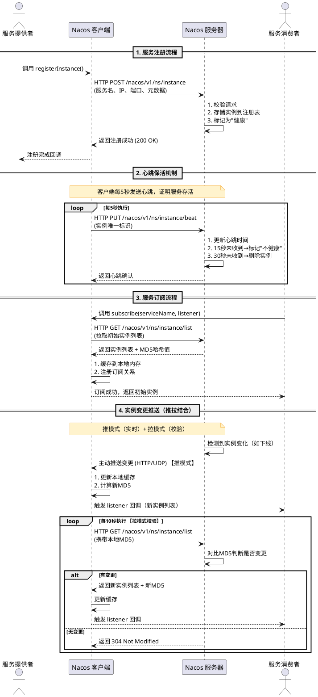
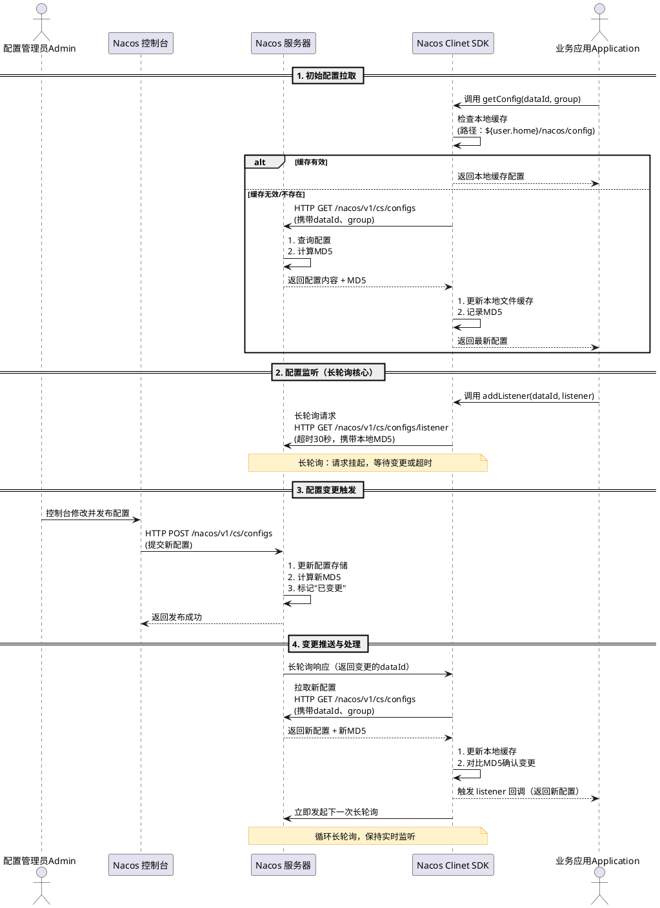

# Nacos
> 更好的发现、配置和管理微服务
- 动态服务发现, 服务健康监测
- 配置管理

## 服务注册与发现

```plantuml
@startuml Nacos 服务注册发现原理


actor 服务提供者 as Provider
participant "Nacos 客户端" as SDK
participant "Nacos 服务器" as Server
actor 服务消费者 as Consumer

' 样式定义
skinparam participant {
  BackgroundColor #f0f8ff
  BorderColor #2c3e50
}
skinparam actor {
  BackgroundColor #e8f4fd
  BorderColor #2980b9
}
skinparam note {
  BackgroundColor #fff3cd
  BorderColor #f39c12
}

== 1. 服务注册流程 ==
Provider -> SDK: 调用 registerInstance()
SDK -> Server: HTTP POST /nacos/v1/ns/instance\n(服务名、IP、端口、元数据)
Server -> Server: 1. 校验请求\n2. 存储实例到注册表\n3. 标记为"健康"
Server --> SDK: 返回注册成功 (200 OK)
SDK --> Provider: 注册完成回调

== 2. 心跳保活机制 ==
note over SDK, Server: 客户端每5秒发送心跳，证明服务存活
loop 每5秒执行
  SDK -> Server: HTTP PUT /nacos/v1/ns/instance/beat\n(实例唯一标识)
  Server -> Server: 1. 更新心跳时间\n2. 15秒未收到→标记"不健康"\n3. 30秒未收到→剔除实例
  Server --> SDK: 返回心跳确认
end

== 3. 服务订阅流程 ==
Consumer -> SDK: 调用 subscribe(serviceName, listener)
SDK -> Server: HTTP GET /nacos/v1/ns/instance/list\n(拉取初始实例列表)
Server --> SDK: 返回实例列表 + MD5哈希值
SDK -> SDK: 1. 缓存到本地内存\n2. 注册订阅关系
SDK --> Consumer: 订阅成功，返回初始实例

== 4. 实例变更推送（推拉结合） ==
note over Server, SDK: 推模式（实时）+ 拉模式（校验）
Server -> Server: 检测到实例变化（如下线）
Server --> SDK: 主动推送变更 (HTTP/UDP) 【推模式】
SDK -> SDK: 1. 更新本地缓存\n2. 计算新MD5
SDK --> Consumer: 触发 listener 回调（新实例列表）

loop 每10秒执行 【拉模式校验】
  SDK -> Server: HTTP GET /nacos/v1/ns/instance/list\n(携带本地MD5)
  Server -> Server: 对比MD5判断是否变更
  alt 有变更
    Server --> SDK: 返回新实例列表 + 新MD5
    SDK -> SDK: 更新缓存
    SDK --> Consumer: 触发 listener 回调
  else 无变更
    Server --> SDK: 返回 304 Not Modified
  end
end
@enduml
```
### Demo - Js

服务注册: 

<<< docs/afterEnd/nacos/service-provider.js

消费者服务发现

<<< docs/afterEnd/nacos/service-consumer.js

## 动态配置

```plantuml
@startuml Nacos 配置变更与推送原理
' 参与者定义
actor 配置管理员Admin as Admin
participant "Nacos 控制台" as Console
participant "Nacos 服务器" as Server
participant "Nacos Clinet SDK" as SDK
actor 业务应用Application as App

' 样式定义
skinparam participant {
  BackgroundColor #f0f8ff
  BorderColor #2c3e50
}
skinparam actor {
  BackgroundColor #e8f4fd
  BorderColor #2980b9
}
skinparam note {
  BackgroundColor #fff3cd
  BorderColor #f39c12
}

== 1. 初始配置拉取 ==
App -> SDK: 调用 getConfig(dataId, group)
SDK -> SDK: 检查本地缓存\n(路径：${user.home}/nacos/config)
alt 缓存有效
  SDK --> App: 返回本地缓存配置
else 缓存无效/不存在
  SDK -> Server: HTTP GET /nacos/v1/cs/configs\n(携带dataId、group)
  Server -> Server: 1. 查询配置\n2. 计算MD5
  Server --> SDK: 返回配置内容 + MD5
  SDK -> SDK: 1. 更新本地文件缓存\n2. 记录MD5
  SDK --> App: 返回最新配置
end

== 2. 配置监听（长轮询核心） ==
App -> SDK: 调用 addListener(dataId, listener)
SDK -> Server: 长轮询请求\nHTTP GET /nacos/v1/cs/configs/listener\n(超时30秒，携带本地MD5)
note over SDK, Server: 长轮询：请求挂起，等待变更或超时

== 3. 配置变更触发 ==
Admin -> Console: 控制台修改并发布配置
Console -> Server: HTTP POST /nacos/v1/cs/configs\n(提交新配置)
Server -> Server: 1. 更新配置存储\n2. 计算新MD5\n3. 标记"已变更"
Server --> Console: 返回发布成功

== 4. 变更推送与处理 ==
Server -> SDK: 长轮询响应（返回变更的dataId）
SDK -> Server: 拉取新配置\nHTTP GET /nacos/v1/cs/configs\n(携带dataId、group)
Server --> SDK: 返回新配置 + 新MD5
SDK -> SDK: 1. 更新本地缓存\n2. 对比MD5确认变更
SDK --> App: 触发 listener 回调（返回新配置）

' 持续监听循环
SDK -> Server: 立即发起下一次长轮询
note over SDK, Server: 循环长轮询，保持实时监听
@enduml
```