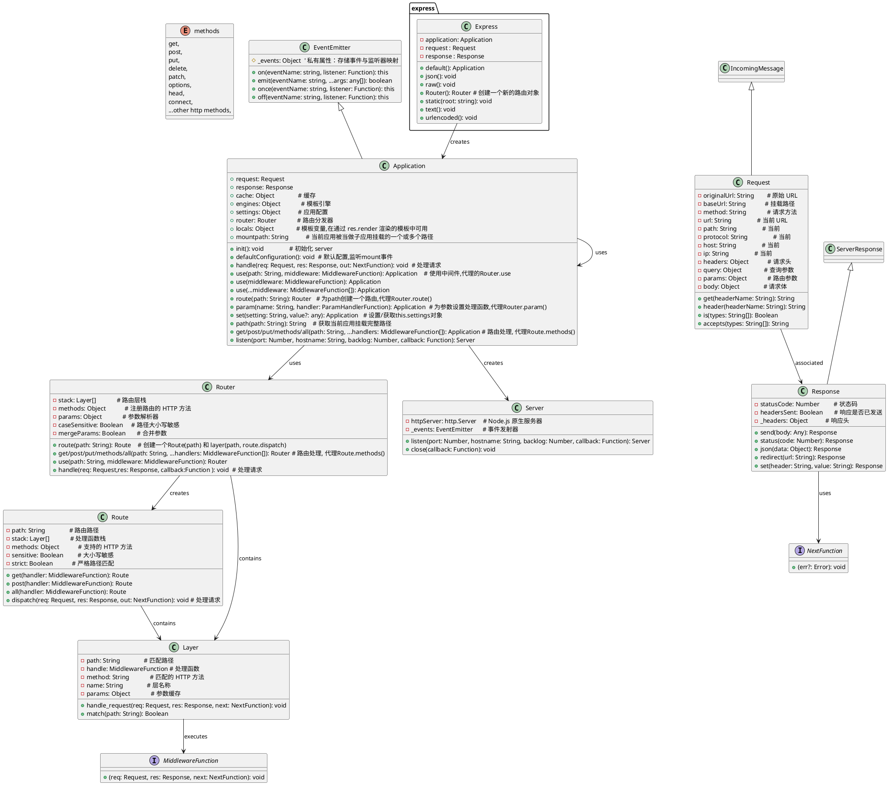
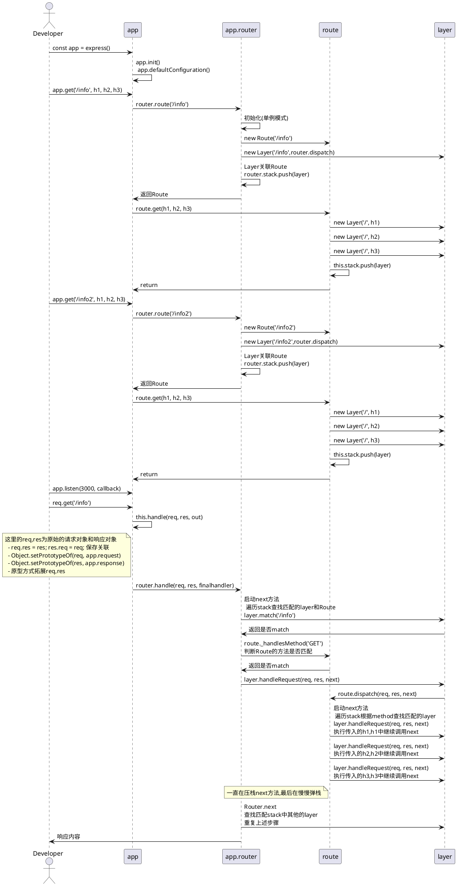

# Express源码学习

## 常规使用
```js
const express = require("express");

const app = express()

app.get('/info', (req, res, next) => {
    console.log("req time: ", Date.now(), req.url);
    next()
}, (req, res, next) => {
    console.log("secode layer");
    next()
}, (req, res, next) => {
    console.log("third layer");
    res.json("/info")
})

app.get('/info2', (req, res, next) => {
    console.log("req time: ", Date.now(), req.url);
    next()
}, (req, res, next) => {
    console.log("secode layer");
    next()
}, (req, res, next) => {
    console.log("third layer");
    res.json("/info")
})

app.listen(3000, () => {
    console.log(`Example app listening on port 3000`)
})
```
## 模块类关系图




## 请求处理时序图
应用启动后创建好Router的layer 和Route的layer stack, 请求处理时串行Router的layer stack中所有的Route的layer stack


