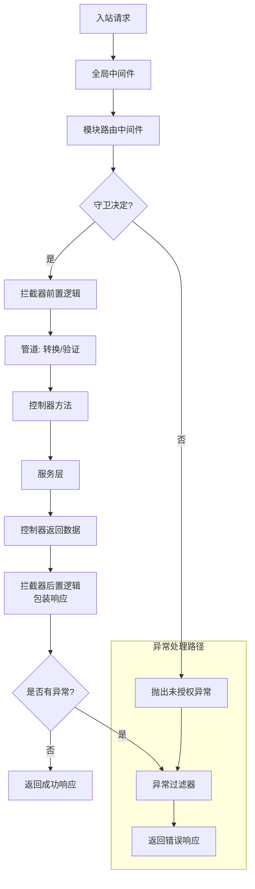

# Nestjs

查看帮助 `nest --help`

项目创建

- nest create 项目名称
- pnpm run start:dev 启动开发
- nest g res `<name>` 生成 res 资源

## 重要概念

- 控制器@Controller: 路由, 处理传入的请求并向客户端返回响应, 必须属于某一个模块
- 提供器@providers: 由 Nestjs 容器管理的 js 类, 框架负责实例化, 管理其生命周期, 作为依赖注入的类
  - 标准提供者: providers: [CatsService] 相当于 providers: [
    {
    provide: CatsService,
    useClass: CatsService,
    },
    ];
  - 值提供者, 注入常量值 providers: [
    {
    provide: CatsService,
    useValue: { aa: 'bb', 'cc': 'some 引用'},
    },
    ];
  - 工厂提供者 useFactory,允许动态创建提供者,为工厂函数返回的值
  - 别名提供者：useExisting
- module@Module: nest 组织应用的方式, 应用至少需要有一个根模块
  - providers: 将由 Nest 注入器实例化并且至少可以在该模块中共享的提供程序
  - controllers: 此模块中定义的必须实例化的控制器集
  - imports: 导出此模块所需的提供程序的导入模块列表
  - exports: 这个模块提供的 providers 的子集应该在导入这个模块的其他模块中可用。你可以使用提供器本身或仅使用其令牌（provide 值）

## 工程目录

- src/main.ts 应用程序的入口文件，它使用核心函数 NestFactory 来创建 Nest 应用程序实例。
- src/app.module.ts 应用程序的根模块。
- src/app.controller.ts 一个具有单个路由的基本控制器。
- src/app.service.ts 一个具有单个方法的基本服务。

## 模块

下述中的 `js类` 其实是为框架读取使用, 真正导出导入的是容器中帮我们创建好的实例

- 共享模块: 使用 @Module.exports 导出 `js类`, 其他需要使用的模块中 @Module.import
- 全局模块: 在模块上使用@Global()注解, 其他模块直接注入`js类`即可, 不需要在@Module.import
- 动态模块: 编写模块类, 实现 forRoot 静态方法, 返回模块配置对象即可, 比如:

```ts
@Module({
  imports: [DatabaseModule.forRoot([User])],
  exports: [DatabaseModule] // 需重新导出动态模块时，可在导出数组中省略 forRoot() 方法调用
})
export class AppModule {}
```

## 中间件 (Middleware)

- 职责：最基础的层面。处理请求和响应对象，执行任何代码，对请求和响应进行更改。它可以结束请求-响应周期（比如权限验证失败直接返回 403）。
- 使用场景：
  - CORS (跨域资源共享)
  - 日志记录 (Morgan)
  - 请求体解析 (BodyParser)
  - Cookie / Session 处理
- 特点：最通用，但职责不明确，什么都能做。

## 守卫 (Guard)

- 职责：路由守卫。只有一个核心任务——决定一个请求是否应该由路由处理程序处理。它通常实现 CanActivate 接口，返回一个布尔值。

- 使用场景：
  - 身份认证 (Authentication)：检查请求是否携带有效的 JWT Token。
  - 授权 (Authorization)：检查认证通过的用户是否有权限访问该接口（例如：角色校验 RolesGuard）。
- 特点：在中间件之后执行，且可以访问 ExecutionContext（执行上下文），拥有更多的关于当前处理程序的信息。

## 拦截器 (Interceptor)

- 职责：在方法执行前后添加额外的逻辑。它可以在函数执行前、后拦截，甚至可以完全覆盖或延迟函数的执行（例如缓存）。它实现了 AOP（面向切面编程） 的思想。

- 使用场景：

  - 额外逻辑绑定：如缓存拦截、日志记录。
  - 转换响应：将处理程序返回的数据包装成统一的格式（{ code: 200, data: {}, message: 'success' }）。
  - 转换异常：将方法抛出的异常转换为另一种异常。
  - 扩展函数行为：例如超时处理。

- 特点：功能非常强大，是 NestJS 的亮点之一。它可以修改函数返回的结果。

## 管道 (Pipe)

- 职责：数据转换和验证。将输入数据转换为所需的格式（如字符串转为整数），并验证输入数据，如果数据不合格则抛出异常。

- 使用场景：

  - 验证：使用 class-validator 库验证 DTO（数据传输对象），无效时自动抛出 BadRequestException。

    ```ts
    import { IsString, IsInt } from 'class-validator'
    const install = 'npm i class-validator class-transformer'
    export class CreateCatDto {
      @IsString()
      name: string
      @IsInt()
      age: number
      @IsString()
      breed: string
    }
    // 启用全局作用域管道
    app.useGlobalPipes(
      new ValidationPipe({
        whitelist: true, // 自动移除非DTO字段
        forbidNonWhitelisted: true, // 禁止非DTO字段
        transform: true // 自动类型转换
      })
    )
    ```

  - 转换：将路径参数 :id 从字符串转换为数字 (ParseIntPipe)。

    ```ts
    // ParseIntPipe实例化的责任交给框架并启用依赖注入, 也可以手动实例化
    // async findOne(@Param('id', ParseIntPipe) id: number) {
    async findOne(@Param('id', new ParseIntPipe({ errorHttpStatusCode: HttpStatus.NOT_ACCEPTABLE })) id: number) {
      return this.catsService.findOne(id);
    }
    ```

- 特点：通常用于控制器路由处理程序的参数级别。

## 异常过滤器 (Exception Filter)

- 职责：捕获和处理应用程序中抛出的异常。它是整个请求处理链的“最终错误处理程序”。

- 使用场景：

  - 捕获未被处理的异常，并返回一个用户友好的错误响应。

  - 自定义错误响应的格式。

  - 记录错误日志。

- 特点：它不预防错误，而是响应错误。可以全局应用，也可以应用于特定的控制器或路由。

## 请求流程

可以把 NestJS 处理请求的过程想象成一个洋葱模型（Onion Model），请求从外一层层进入，响应则从内一层层返回


