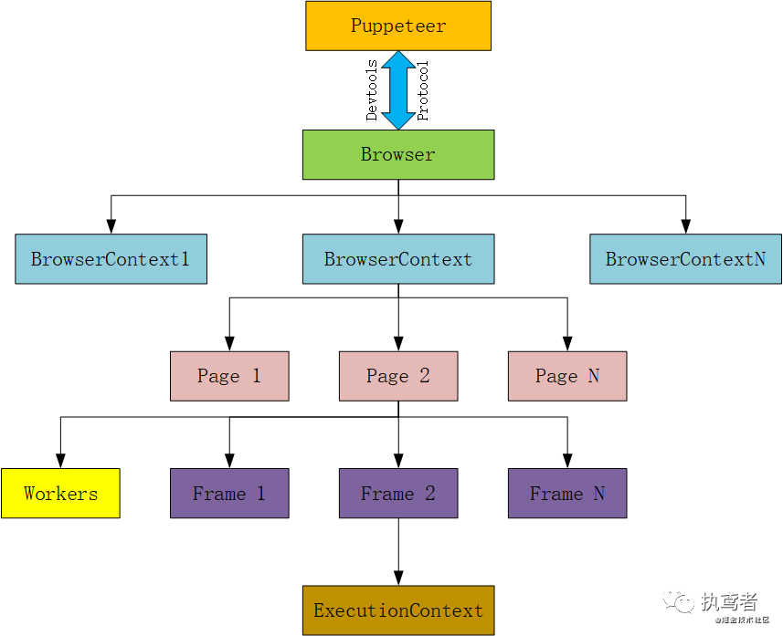

# Puppeteer

浏览器自动化

> pnpm add puppeteer # Downloads compatible Chrome during installation.
> pnpm add puppeteer-core # Alternatively, install as a library, without downloading Chrome.



## 开发

> launch/connect 一个 browser，create 一些 pages，然后用 Puppeteer 的 API 操纵它们

### 1. 创建 browser 实例

```js
// https://pptr.nodejs.cn/api/puppeteer.launchoptions
browser = await puppeteer.launch({
  executablePath: '/Applications/Google Chrome.app/Contents/MacOS/Google Chrome', // 浏览器程序路径
  headless: false,
  devtools: false,
  defaultViewport: { width: 1920, height: 1080 }, // 设置初始窗口大小
  userDataDir: userDataDir // ✅ 启用用户数据目录自动保存状态
})
```

### 2. 创建页面

可以使用`browser.newPage()` 打开单个页面, 也可以使用` BrowserContexts` 隔离自动化任务,打开多个页面

```js
const context = await browser.createBrowserContext()
const page1 = await context.newPage()
const page2 = await context.newPage()
await context.close()
```

### 3. 访问页面

```ts
await page.goto('https://example.com')
await page.goto('https://example.com', { waitUntil: 'domcontentloaded/loaded/networkidle0/networkidle2' })
```

### 4. [页面交互](https://pptr.nodejs.cn/guides/page-interactions)

- 你确定 DOM 元素已存在

  - page.$() 返回与选择器匹配的单个元素。
  - page.$$() 返回与选择器匹配的所有元素。
  - page.$eval() 返回对与选择器匹配的第一个元素运行 JavaScript 函数的结果。

  - page.$$eval() 返回对与选择器匹配的每个元素运行 JavaScript 函数的结果

- 你不确定 DOM 元素是否存在 优先使用定位器 Locator(`page.locator()` 或 `frame.locator()`实例化), 如不满足需求在尝试底层 API, `page.waitForSelector()` 或 `ElementHandle`

#### 常用 Locator 事件

| 交互           | API                                                                                      |
| -------------- | ---------------------------------------------------------------------------------------- |
| click          | await page.locator('button').click();                                                    |
| input          | await page.locator('input').fill('value');                                               |
| hover          | await page.locator('div').hover();                                                       |
| 等待元素可见   | await page.locator('.loading').wait();                                                   |
| 元素过滤       | await page.locator('button').filter(button => button.innerText === 'My button').click(); |
| 从定位器返回值 | const enabled = await page.locator('button').map(button => !button.disabled).wait();     |

#### waitForSelector(selector,options)

等待元素在 DOM 中可用, 方法存在于 Page、Frame 和 ElementHandle 实例上

> 某些页面级 API（例如 page.click(selector)、page.type(selector)、page.hover(selector)）是使用 waitForSelector 实现的

### 5. 捕获页面数据

- 如果使用定位器, 可使用 map 方法`const enabled = await page.locator('button').map(button => !button.disabled).wait();`
- 使用 JS 执行能力,
  - `page.evaluate`将函数转成字符串,发送到目标页面执行, `const three = await page.evaluate(() => {return 1 + 2;});`, 脚本返回普通对象时会通过 JSON 序列化传输
  - `page.evaluateHandle`, 处理返回的对象，Puppeteer 提供的通过引用返回对象的方法

#### 5.1请求抓取
```ts
const page = await browser.newPage();
page.on('request', request => {
  console.log(request.url());
});

page.on('response', response => {
  console.log(response.url());
});
```
