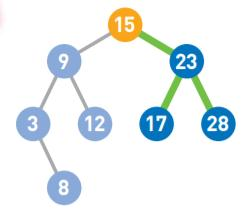

## 学习算法
---
### 数据结构
- 栈
顺序存储结构
链式存储结构
应用： 递归   四则运算的括号问题

- 队列
平常我们排队
顺序存储： 给定数组长度，只能存长度个数据
使用循环队列解决问题 --> 
指针front  rear(队尾  是下一个元素要存放的位置)
when  (rear +1 ) % queueSize == front   队列满 (保留了一个元素位置不用)
队列的长度： (  rear - front + queueSize) % queueSize

参考: 我的第一本算法书.pdf
- 哈希表存储的是由键（key）和值（value）组成的数据。
  - 线性查询的缺点: 数据量越多，线性查找耗费的时间就越长。
    由此可知 ：由于数据的查询较为耗时，所以此处并不适合使用数组来存储数据。但使用哈希表便可以解决这个问题。这次我们用5个箱子的数组来存储数据。使用哈希函数（Hash）计算 Item的键,也就是哈希值,将得到的哈希值除以数组的长度5，求得其余数,结巴数据放到数组的余数位置,如果出现冲突(另一个数据的哈希值%5得到的位置已经有元素了),使用链表,在其后存储数据
  - 查询数据(key="wang"): 
    现根据哈希算法就算出哈希值,得到存再数组里面的位置,在在链表中去线性查找key是wang的数据
  - 哈希冲突解决: 链地址法/开放地址法/

- 堆: 是一种图的树形结构    
被用于实现“优先队列”
优先队列是一种数据结构，可以自由添加数据，但取出数据时要从最小值开始按顺序取出。
堆中的每个结点最多有两个子结点。树的形状取决于数据的个数。另外，结点的排列顺序为从上到下，同一行里则为从左到右。

  - 在堆中存储数据时必须遵守这样一条规则   
*子结点必定大于父结点*。因此，最小值被存储在顶端的根结点中。往堆中添加数据时，为了遵守这条规则，一般会把新数据放在最下面一行靠左的位置。当最下面一行里没有多余空间时，就再往下另起一行，把数据加在这一行的最左端。

  - 取数据:   
取出的是最上面的数据。由于最上面的数据被取出，因此堆的结构也需要重新调整。
将最后的数据（最后一行,最后一个节点）移动到最顶端。
如果子结点的数字小于父结点的，就将父结点与其左右两个子结点中较小的一个进行交换。

  - 解说:  
堆中最顶端的数据始终最小，所以无论数据量有多少，取出最小值的时间复杂度都
为 O(1)。
另外，因为取出数据后需要将最后的数据移到最顶端，然后一边比较它与子结点数据
的大小，一边往下移动，所以取出数据需要的运行时间和树的高度成正比。假设数据量为
n，根据堆的形状特点可知树的高度为 log2n ，那么重构树的时间复杂度便为 O(logn)。
添加数据也一样。在堆的最后添加数据后，数据会一边比较它与父结点数据的大
小，一边往上移动，直到满足堆的条件为止，所以添加数据需要的运行时间与树的高度
成正比，也是 O(logn)。

- 二叉查找树  
数据存储于二叉查找树的各个结点中。
二叉查找树有两个性质。
**第一个是每个结点的值均大于其左子树上任意一个结点的值。
第二个是每个结点的值均小于其右子树上任意一个结点的值。**

根据这两个性质可以得到以下结论。首先，二叉查找树的最小结点要从顶端开始，往其左下的末端寻找。
反过来，二叉查找树的最大结点要从顶端开始，往其右下的末端寻找。

  - 添加数据:
顶端结点开始寻找添加数字的位置。
依次往下比较,得到位置

  - 删除数据:
删除的节点下面没节点
删除的节点下面一个节点
删除的节点下面两个节点 左右子树重新梳理数据

  - 解说:
我们可以把二叉查找树当作是二分查找算法思想的树形结构体现（二分查找的详细
说明在 3-2 节）。因为它具有前面提到的那两个性质，所以在查找数据或寻找适合添加
数据的位置时，只要将其和现有的数据比较大小，就可以根据比较结果得知该往哪边移
动了。
比较的次数取决于树的高度。所以如果结点数为 n，而且树的形状又较为均衡的话，
比较大小和移动的次数最多就是 log2n。因此，时间复杂度为 O(logn)。但是，如果树的
形状朝单侧纵向延伸，树就会变得很高，此时时间复杂度也就变成了 O(n)。

### 排序
---
- 冒泡排序
- 选择排序
- 插入排序
- 堆排序  
堆排序的特点是利用了数据结构中的堆。  

>堆排序一开始需要将 n 个数据存进堆里，所需时间为 O(nlogn)。排序过程中，堆从空堆的状态开始，逐渐被数据填满。由于堆的高度小于 log2n，所以插入 1 个数据所需要的时间为 O(logn)。  
每轮取出最大的数据并重构堆所需要的时间为 O(logn)。由于总共有 n 轮，所以重构后排序的时间也是 O(nlogn)。因此，整体来看堆排序的时间复杂度为 O(nlogn)。
这样来看，堆排序的运行时间比之前讲到的冒泡排序、选择排序、插入排序的时间O(n2) 都要短，但由于要使用堆这个相对复杂的数据结构，所以实现起来也较为困难。

- 归并排序  
归并排序算法会把序列分成长度相同的两个子序列，当无法继续往下分时（也就是每个子序列中只有一个数据时），就对子序列进行归并。归并指的是把两个排好序的子序列合并成一个有序序列。该操作会一直重复执行，直到所有子序列都归并为一个整体为止。  
总的运行时间为 O(nlogn)，这与前面讲到的堆排序相同。

- 快排  
快速排序是一种“分治法”。它将原本的问题分成两个子问题（比基准值小的数和比基准值大的数），然后再分别解决这两个问题。子问题，也就是子序列完成排序后，再像一开始说明的那样，把他们合并成一个序列，那么对原始序列的排序也就完成了。  
不过，解决子问题的时候会再次使用快速排序，甚至在这个快速排序里仍然要使用快速排序。只有在子问题里只剩一个数字的时候，排序才算完成。
像这样，在算法内部继续使用该算法的现象被称为“递归”。
>整体的时间复杂度为 O(nlogn)。
如果运气不好，每次都选择最小值作为基准值，那么每次都需要把其他数据移到基准值的右边，递归执行 n 行，运行时间也就成了 O(n2)。  
这就相当于每次都选出最小值并把它移到了最左边，这个操作也就和选择排序一样了。此外，如果数据中的每个数字被选为基准值的概率都相等，那么需要的平均运行时间为 O(nlogn)。

### 数组查找
- 线性查找  
线性查找是一种在数组中查找数据的算法（关于数组的详细讲解在 1-3 节）。即便数据没有按顺序存储，也可以应用线性查找。线性查找的操作很
简单，只要在数组中从头开始依次往下查找即可。

> 线性查找需要从头开始不断地按顺序检查数据，因此在数据量大且目标数据靠后，
或者目标数据不存在时，比较的次数就会更多，也更为耗时。若数据量为 n，线性查找的时间复杂度便为 O(n)。

- 二分查找  
它只能查找已经排好序的数据。二分查找通过比较数组中间的数据与目标数据的大小，可以得知目标数据是在数组的左边还是右边。因此，比较一次就可以把查找范围缩小一半.   
数据量为 n 的数组，将其长度减半 log2n 次后，其中便只剩一个数据了。也就是说，在二分查找中重复执行“将目标数据和数组中间的数据进行比较后将查找范围减半”的操作 log2n 次后，就能找到目标数据（若没找到则可以得出数据不存在的结论），因此它的时间复杂度为 O(logn)。

### 安全算法
- 哈希函数  
第一个特征是输出的哈希值数据长度不变。  
第二个特征是如果输入的数据相同，那么输出的哈希值也必定相同。  
第三个特征是即使输入的数据相似，但哪怕它们只有一比特的差别，那么输出的哈希值也会有很大的差异。输入相似的数据并不会导致输出的哈希值也相似。  
第四个特征是即使输入的两个数据完全不同，输出的哈希值也有可能是相同的，虽然出现这种情况的概率比较低。这种情况叫作“哈希冲突”。  
第五个特征是不可能从哈希值反向推算出原本的数据。输入和输出不可逆这一点和加密有很大不同。  
最后一个特征是求哈希值的计算相对容易。

>哈希函数的算法中具有代表性的是 MD5 ①、SHA-1 ②和 SHA-2 等

